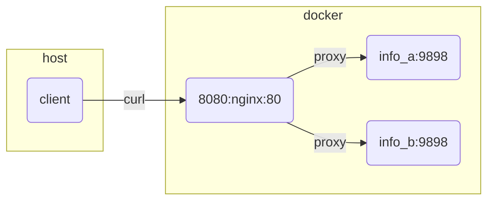

# README

Demonstrate and test websockets reverse proxy  

44_reverse_proxy example [here](https://github.com/chrisguest75/docker_build_examples/tree/master/44_reverse_proxy)  

## Architecture



## Start

```sh
# start 
docker compose up -d

# logs
docker compose logs podinfo_a 
```

## Test (vscode rest-client)

```sh
# install the extension
code --install-extension humao.rest-client
```

Open the [test.http](./test.http) file and send some requests  

## Websockets (websocat)

```sh
# install
brew install websocat
```

Test the websocket loadbalancing

```sh
# logs for the containers
docker compose logs info_a -f
docker compose logs info_b -f 

# talking direct to the pods (type)
websocat --text ws://0.0.0.0:9001/ws/echo -n 
websocat --text ws://0.0.0.0:9002/ws/echo -n 

# talking direct through route
websocat --text ws://0.0.0.0:8080/wsa/ws/echo -n 
websocat --text ws://0.0.0.0:8080/wsb/ws/echo -n 

# NOTE: Keep connecting and reconnecting and you'll see the logs on each container.
websocat --text ws://0.0.0.0:8080/ws/echo -n 
```

## Websockets (wscat)

```sh
# install
nvm use v16.13.2                     
npm install -g wscat  
npm --global list    
```

Test the websocket loadbalancing

```sh
# connect to proxy and relay websockets
wscat -c ws://0.0.0.0:8080/ws/echo    
wscat -c ws://0.0.0.0:8080/ws/echo -x hello

# direct connection (works if port is open in docker-compose.yaml)
wscat -c ws://0.0.0.0:9001/ws/echo

wscat -c ws://0.0.0.0:8080/ws/echo -x "/ping" --slash

# send control codes over connection using slash
wscat -c ws://0.0.0.0:8080/ws/echo --slash
# /ping
# /pong 
# /close
```

## Cleanup

```sh
docker compose down
```

## Resources

* NGINX as a WebSocket Proxy [here](https://www.nginx.com/blog/websocket-nginx/)  
* dockerhub nginx image [here](https://hub.docker.com/_/nginx?tab=tags)  
* REST Client extension [here](https://marketplace.visualstudio.com/items?itemName=humao.rest-client)  
* stefanprodan/podinfo repo [here](https://github.com/stefanprodan/podinfo)  
* websockets/wscat repo [here](https://github.com/websockets/wscat)  
* wscat npm package [here](https://www.npmjs.com/package/wscat)
* websocat repo [here](https://github.com/vi/websocat/blob/master/doc.md)  
