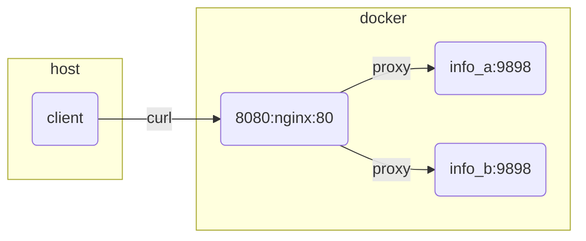

# README

Demonstrate and test websockets reverse proxy  

44_reverse_proxy example [here](https://github.com/chrisguest75/docker_build_examples/tree/master/44_reverse_proxy)  

## Architecture



## Start

```sh
# start 
docker compose up -d

# logs
docker compose logs podinfo_a 
```

## Test

```sh
# install the 
code --install-extension humao.rest-client
```

Open the [test.http](./test.http) file and send some requests  

```sh
nvm use v16.13.2                     
npm install -g wscat  
npm --global list    

# connect to proxy and relay websockets
wscat -c ws://0.0.0.0:8080/ws/echo    
wscat -c ws://0.0.0.0:8080/ws/echo -x hello

# direct connection (works if port is open in docker-compose.yaml)
wscat -c ws://0.0.0.0:9001/ws/echo

wscat -c ws://0.0.0.0:8080/ws/echo -x "/ping" --slash

wscat -c ws://0.0.0.0:8080/ws/echo --slash
# /ping
# /pong 
# /close
```

## Cleanup

```sh
docker compose down
```

## Resources

* NGINX as a WebSocket Proxy [here](https://www.nginx.com/blog/websocket-nginx/)  
* dockerhub nginx image [here](https://hub.docker.com/_/nginx?tab=tags)  
* REST Client extension [here](https://marketplace.visualstudio.com/items?itemName=humao.rest-client)  
* stefanprodan/podinfo repo [here](https://github.com/stefanprodan/podinfo)  
https://github.com/websockets/wscat
https://www.npmjs.com/package/wscat


